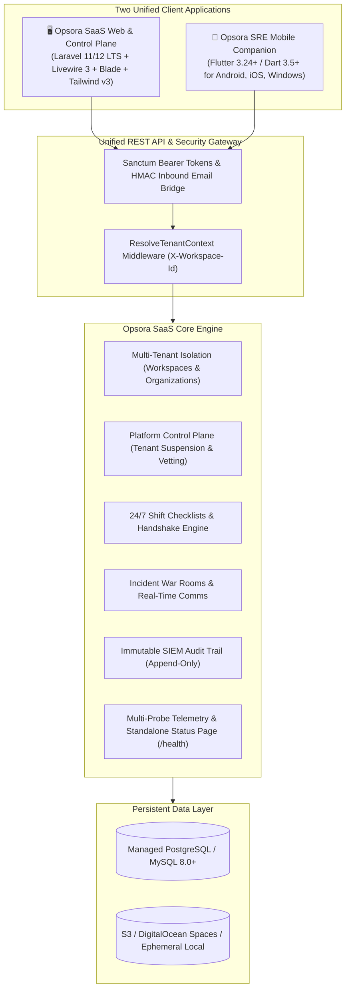
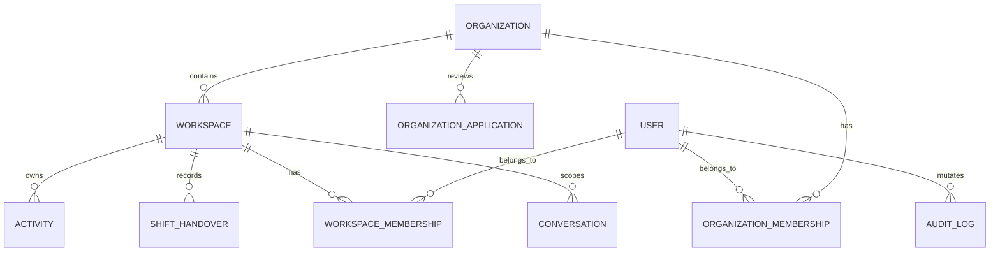

# Opsora SaaS — Multi-Tenant Site Reliability Engineering Cloud Platform

> **An enterprise-grade, multi-tenant SRE operations platform and Flutter mobile companion** featuring organizational tenancy isolation, super admin platform control plane, real-time shift checklists, immutable SIEM audit ledgers, incident war rooms, and continuous telemetry.

[](https://opsora-sre.onrender.com)
[](LICENSE)
[](CONTRIBUTING.md)
[-brightgreen)](tests/)
[](npontu_sre_mobile/test/)
[](https://php.net)
[](https://laravel.com)
[](npontu_sre_mobile/)
[](docs/saas/)
[](render.yaml)
[](#-60-second-quickstart-docker)

🌐 **Live SaaS Endpoints & Console**:
- **Web Console**: [https://opsora-sre.onrender.com](https://opsora-sre.onrender.com)
- **Platform Control Plane (Super Admin)**: [https://opsora-sre.onrender.com/admin/platform](https://opsora-sre.onrender.com/admin/platform)
- **Tenant Onboarding & Registration**: [https://opsora-sre.onrender.com/register](https://opsora-sre.onrender.com/register)
- **Real-Time Telemetry & Status HUD**: [https://opsora-sre.onrender.com/health](https://opsora-sre.onrender.com/health)
- **OpenAPI 3.0 Specs & Docs**: [https://opsora-sre.onrender.com/docs](https://opsora-sre.onrender.com/docs)
- **REST API v1 Gateway**: `https://opsora-sre.onrender.com/api/v1`

[](https://render.com/deploy?repo=https://github.com/mhiskall282/opsora-saas)

> 🌟 **Star this repository** if you find Opsora SaaS valuable for your engineering and operations teams! It helps the platform grow and reach more SREs worldwide.

---

### ⚡ 60-Second Quickstart (Docker)

Get Opsora SaaS running locally with all services (Web, PostgreSQL, Worker) in one command:

```bash
# 1. Clone the SaaS repository
git clone https://github.com/mhiskall282/opsora-saas.git
cd opsora-saas

# 2. Copy environment template
cp .env.example .env

# 3. Build and launch containers
docker compose up -d

# 4. Run multi-tenant migrations and baseline seeds
docker compose exec app php artisan migrate --seed
```

Open [http://localhost:8000](http://localhost:8000) to access the landing page and onboarding portal!

---

### 📱 Download Android APK & Mobile Companion

Pre-compiled release APKs and mobile companion artifacts for on-call engineers:

- **Android APK (ARM64)**: Download pre-built APKs directly from [GitHub Releases](https://github.com/mhiskall282/opsora-saas/releases) or build locally:
  ```bash
  cd npontu_sre_mobile
  flutter build apk --split-per-abi --dart-define=API_BASE_URL=https://opsora-sre.onrender.com/api/v1
  ```
- **App Store & Google Play Publishing**: Review the step-by-step submission checklist in the [Store Publishing Guide](docs/deployment/store-publishing-guide.md).

---

## 🌐 Dual-Application Ecosystem: Web Cockpit & Mobile Companion

Opsora SaaS operates as a unified dual-application ecosystem designed to eliminate operational blind spots across desktop mission control and on-call field operations.



---

## 🏢 Enterprise Multi-Tenant SaaS Architecture

Opsora SaaS is built from the ground up for multi-tenancy, providing safe isolation between customer organizations while enabling rapid self-service provisioning.



### 1. Tenancy Isolation & Query Scoping
- **Tenant Scope Enforcement**: All operational models (`Activity`, `ShiftHandover`, `Conversation`, `OperationalNotification`) apply the `TenantScope` and utilize the `BelongsToWorkspace` trait.
- **Header-Driven API Ingress**: API requests resolve tenant boundaries via the `X-Workspace-Id` HTTP header. The `ResolveTenantContext` middleware verifies user membership before fulfilling requests.
- **Session-Driven Web Hub**: The Web Cockpit persists active workspace selection in the session (`active_workspace_id`), strictly validating that the authenticated user holds an active membership.
- **Personal & Organizational Workspaces**: Users can manage personal workspaces for individual tracking or join enterprise organizations with company codes (e.g. `NPT-OPS-01`).

### 2. Platform Administrative Control Plane (`/admin/platform`)
Super Administrators enjoy cross-tenant operational governance:
- **Organization Vetting Queue**: Automated risk scoring evaluates self-service applications. Low-risk applications are auto-approved; customer-hosted and enterprise applications enter a manual vetting queue.
- **Organization Suspension & Reactivation**: 1-click tenant lockout revoking all active Sanctum tokens instantly upon suspension.
- **Global Emergency Maintenance Mode**: Platform-wide lockdown via `EnsurePlatformNotUnderMaintenance` with bypass exceptions for Super Admins.
- **Global Broadcast Announcements**: High-visibility banner notifications dispatachable across all tenant workspaces.
- **Feature Flags Engine**: Dynamic capability flags togglable globally or per-organization.
- **Support Impersonation Mode**: Secure audit-logged impersonation protocol enabling platform operators to resolve customer issues within tenant context.

---

## 🖥️ Feature Breakdown: Web Platform & Control Plane

| Module | Route / Component | Description |
|---|---|---|
| **Public Landing Page** | `GET /` | High-impact overview of the SaaS platform: capability matrix, 4-step handover lifecycle, live telemetry, and direct onboarding |
| **SaaS Docs Portal** | `GET /docs` | Complete documentation: `#quickstart`, `#architecture`, `#handover-flow`, `#mobile-setup`, `#governance`, `#faq` |
| **Tenant Onboarding Hub** | `GET /workspaces` | Workspace switcher, personal workspace provisioning, and join organization via company code |
| **Self-Service Registration** | `GET /register` & `/organizations/apply` | Automated onboarding pipeline with domain validation, tier selection, and instant workspace setup |
| **Control Plane Dashboard** | `GET /admin/platform` | Cross-tenant metrics, tenant status list, and platform-wide health monitoring |
| **Application Review Queue** | `GET /admin/platform/organizations/applications` | Review and approve pending organization registration requests |
| **Daily Shift Board** | `GET /activities/daily` | Real-time checklists with inline status updates, mandatory remarks, incident ticket linking, and task delegation |
| **Two-Way Shift Handshake** | `GET /handovers` | 4-phase formal sign-off between outgoing supervisor and incoming lead |
| **Operations Comms & War Rooms** | `GET /messages` | Team channels (`#general-shift`), 1-on-1 direct chat, Base64 PDF/image attachments, `@mention` alerts, and 1-click email reply bridge |
| **Standalone Status Dashboard** | `GET /health` | Zero-sidebar public status page with live UTC clock, subsystem telemetry (DB, cache, memory, mail), and JSON API probe |
| **Automated SRE Reports** | `php artisan reports:send-automated` | Scheduled automated daily, weekly, and monthly digests with SLA metrics and shift health KPIs |
| **SIEM Audit Ledger** | `GET /admin/audit-logs` | Immutable append-only audit trail logging actor identity, IP address, user-agent, and before/after JSON diffs |

---

## 📱 Cross-Platform Flutter Mobile Companion

A native Flutter client (`npontu_sre_mobile`) built for on-call engineers, roaming leads, and standby responders:

### Tech Stack & Security
- **Framework**: Flutter 3.24+ (Dart 3.5+)
- **State Management**: Riverpod (`flutter_riverpod: ^2.6.1`) with feature-first modular architecture
- **Networking**: Dio (`dio: ^5.11.1`) with automatic Bearer token injection and `X-Workspace-Id` resolution
- **Navigation**: Declarative routing via GoRouter (`go_router: ^18.0.1`) with authentication and workspace guards
- **Hardware-Backed KeyStore**: Sanctum API tokens encrypted in Android KeyStore (AES-GCM) and iOS Keychain (`kSecAttrAccessibleAfterFirstUnlock`)

### Mobile Features
1. **Multi-Tenant Workspace Switcher**: Switch between corporate, client, and personal workspaces with instant context switching.
2. **Company Code Join**: Join an organization directly from the mobile app by entering a company code (`NPT-OPS-01`).
3. **Daily Shift Checklist**: Mark items `Done` or `Pending` inline with mandatory resolution remarks.
4. **Digital Two-Way Handover**: Review briefings and accept oncoming operational custody directly on your phone.
5. **Real-Time 3-Second Telemetry HUD**: Live stream of database latency, memory footprint, cache roundtrip, and queue health.
6. **Incident War Rooms on Mobile**: Read and send operational messages, view PDF/image attachments, and receive notifications.

### Running the Mobile App Locally
```bash
cd npontu_sre_mobile
flutter pub get

# Windows Native Desktop (fastest for development)
flutter run -d windows

# Android Emulator (bridges to host via 10.0.2.2:8000)
flutter run -d emulator-5554 --dart-define=API_BASE_URL=http://10.0.2.2:8000/api/v1

# Target Live Render SaaS Backend
flutter run --dart-define=API_BASE_URL=https://opsora-sre.onrender.com/api/v1
```

---

## 🛠️ Tech Stack

| Layer | Technology | Version | Purpose |
|---|---|---|---|
| **Framework** | Laravel | 11.x (LTS) | Robust ecosystem, typed properties, enums, Form Requests, Policies |
| **Language** | PHP | 8.2+ | Strict types (`declare(strict_types=1);`), readonly properties |
| **Database** | PostgreSQL / MySQL | 16+ / 8.0+ | Relational persistence, JSONB capabilities, InnoDB foreign keys |
| **Frontend** | Blade + Livewire | Livewire 3.x | Reactive UI components without full SPA build complexity |
| **CSS** | Tailwind CSS | 3.x | Utility-first design tokens with official Npontu Brand styling |
| **Mobile Client** | Flutter | 3.24+ | Cross-platform on-call client (Android, iOS, Windows Desktop) |
| **Testing** | Pest | 2.x | Expressive, readable feature and unit test suites |
| **Code Style** | Laravel Pint | latest | PSR-12 strict enforcement |

---

## 🧪 Verification & Testing

Both the backend and mobile applications maintain comprehensive test coverage:

```bash
# 1. Run full Laravel backend test suite (173 tests, 827 assertions)
./vendor/bin/pest

# 2. Run PSR-12 code style verification
./vendor/bin/pint --test

# 3. Run Flutter mobile unit and widget tests (25 tests)
cd npontu_sre_mobile
flutter test

# 4. Test live Render production connectivity probe
flutter test test/live_render_integration_test.dart
```

---

## ☁️ Production Cloud Deployment (Blueprints & IaC)

| Target Platform | Infrastructure Blueprint | Step-by-Step Runbook | Architecture Model |
|---|---|---|---|
| **Render.com** | [`render.yaml`](render.yaml) | [`docs/deployment/render.md`](docs/deployment/render.md) | Multi-Service Container (Web + Queue Worker + Cron + Managed PostgreSQL) |
| **Vercel** | [`vercel.json`](vercel.json) | [`docs/deployment/vercel.md`](docs/deployment/vercel.md) | Serverless Functions (`vercel-php`) + Edge Asset CDN + Cloud Database |

### One-Click Render Blueprint Deployment
1. Log in to the [Render Dashboard](https://dashboard.render.com) and click **Blueprints → New Blueprint Instance**.
2. Connect repository `mhiskall282/opsora-saas`.
3. Render automatically provisions:
   - **Opsora Web Service**: Dockerized Apache + PHP 8.2 with OPcache and health check (`/up`).
   - **Opsora Queue Worker**: Background processor for email notifications, alerts, and report generation.
   - **Opsora Cron Scheduler**: Automated daily/weekly SLA digests and periodic telemetry polling.
   - **Managed PostgreSQL Database**: High-availability relational database with SSL enforcement.
4. Click **Apply** — Render automatically builds images, runs migrations, seeds core roles, and provisions SSL certificates.

---

## 📚 Documentation Index

| Document | Description |
|---|---|
| [README.md](README.md) | Complete SaaS platform overview, architecture, web & mobile setup |
| [docs/deployment/environment-variables.md](docs/deployment/environment-variables.md) | Complete environment variable specification, Render cloud secrets, and SMTP/S3 setups |
| [docs/deployment/render.md](docs/deployment/render.md) | Comprehensive 1-click blueprint guide for deploying Web, Workers, Cron, and PostgreSQL on Render |
| [docs/deployment/vercel.md](docs/deployment/vercel.md) | Serverless PHP architecture guide, ephemeral storage bridge, and deployment guide for Vercel |
| [docs/architecture/saas-control-plane-architecture.md](docs/architecture/saas-control-plane-architecture.md) | Enterprise SaaS control plane, tenant isolation, impersonation protocol, and Mermaid diagrams |
| [docs/admin/platform-governance.md](docs/admin/platform-governance.md) | Control plane administrative runbook, emergency maintenance lockout, and operational protocols |
| [docs/mobile-expansion-audit.md](docs/mobile-expansion-audit.md) | Comprehensive architecture audit, database schemas, roles, and API gap analysis |
| [docs/mobile-api.md](docs/mobile-api.md) | Exhaustive REST API v1 developer reference with request/response envelopes |
| [docs/api/openapi.yaml](docs/api/openapi.yaml) | Complete OpenAPI 3.0 / Swagger specification covering all 33 endpoints |
| [docs/security/mobile-threat-model.md](docs/security/mobile-threat-model.md) | STRIDE threat model, mobile security vectors, token revocation, and residual risk mitigations |
| [docs/deployment/mobile-deployment.md](docs/deployment/mobile-deployment.md) | Backend hosting, Google Play App Bundle (AAB), and iOS TestFlight procedures |
| [docs/deployment/store-publishing-guide.md](docs/deployment/store-publishing-guide.md) | Step-by-step Google Play Console & Apple App Store Connect submission guide |
| [docs/mobile-development.md](docs/mobile-development.md) | Mobile developer guide: emulator networking, Riverpod conventions, testing, and debugging |
| [docs/observability.md](docs/observability.md) | SRE observability, correlation IDs, logging standards, Prometheus/Grafana metrics, and runbooks |
| [docs/saas/migration-plan.md](docs/saas/migration-plan.md) | Coexistence migration plan: legacy single-tenant & multi-tenant SaaS side-by-side |

---

## 🤝 Open Source & Contributing

We welcome community contributions, bug reports, and feature proposals! Opsora SaaS is built with the belief that mission-critical operations software should be accessible, robust, and community-driven.

- 📖 **[Contributing Guide](CONTRIBUTING.md)**: Setup guides, coding standards, and PR workflows.
- 📜 **[Code of Conduct](CODE_OF_CONDUCT.md)**: Community standards and inclusive communication expectations.
- 🛡️ **[Security Policy](SECURITY.md)**: Vulnerability disclosure and security contacts.
- 🐛 **[Issue Tracker](https://github.com/mhiskall282/opsora-saas/issues)**: Submit bug reports or feature ideas.
- 💬 **[Discussions & Community](https://github.com/mhiskall282/opsora-saas/discussions)**: Ask questions, share ideas, and connect with other operations engineers.
- 📦 **[Releases & Changelog](https://github.com/mhiskall282/opsora-saas/releases)**: Pre-built artifacts, mobile APKs, and release notes.

### How to Help
1. 🌟 **Star the repository** to boost visibility on GitHub.
2. 🍴 **Fork the project** and submit pull requests for features or bug fixes.
3. 🏷️ Look for issues tagged `good first issue` or `help wanted`.
4. 📝 Improve documentation, tutorials, and runbooks.

---

## 📄 License

Opsora SaaS is open-sourced software licensed under the [MIT License](LICENSE).

---

## 🏷️ GitHub Search Keywords & Topics

`saas` • `multi-tenancy` • `site-reliability-engineering` • `sre` • `devops` • `shift-handover` • `on-call` • `incident-management` • `telemetry` • `system-health` • `uptime-monitoring` • `laravel-11` • `livewire-3` • `flutter` • `dart` • `mobile-app` • `control-plane` • `compliance-audit` • `open-source` • `hacktoberfest` • `docker` • `postgresql` • `tailwind-css`

---

*Built for Npontu Technologies — "Making you free to achieve..."*
