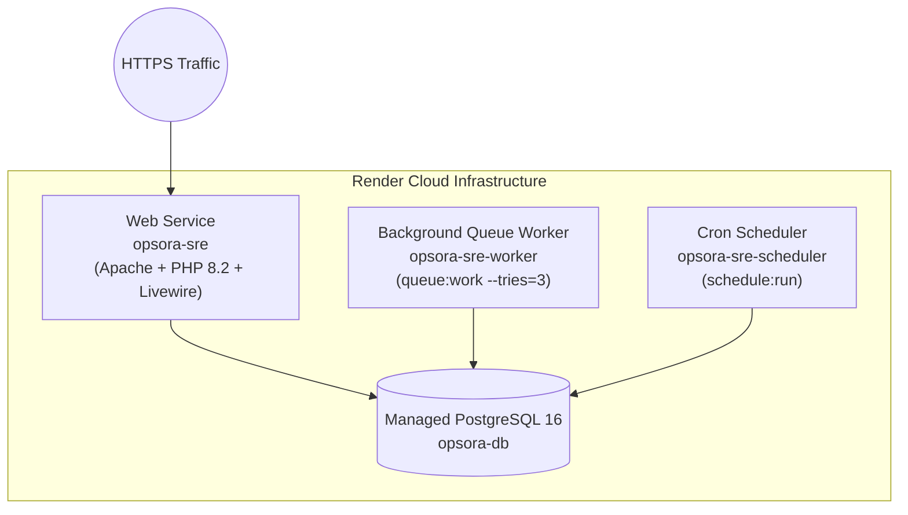

# Deploying Opsora SRE on Render (Infrastructure as Code)

> **Platform**: Render.com  
> **Blueprint Specification**: [`render.yaml`](file:///c:/Users/user/Desktop/npontu-technologies-sre/render.yaml)  
> **Runtime**: Containerized Docker (PHP 8.2 + Apache + Node 20 Vite Assets)  
> **Database**: Managed PostgreSQL 16 (`opsora-db`)

---

## 1. Architecture Overview

Render deploys the Opsora SRE platform using a multi-service blueprint:



- **`opsora-sre` (Web)**: Serves HTTP/HTTPS, Livewire 3 real-time boards, and REST APIs. Runs `docker-entrypoint.sh` which executes migrations and starts Apache.
- **`opsora-sre-worker` (Worker)**: Processes asynchronous email dispatches, audit trail log flushes, and background telemetry.
- **`opsora-sre-scheduler` (Cron)**: Runs every minute (`* * * * *`) to execute daily shift handovers and automated compliance report dispatches.
- **`opsora-db` (Database)**: High-performance managed PostgreSQL instance with automatic backups.

---

## 2. Fast-Track Deployment (Blueprint / IaC)

### Step 1: Push Repository to GitHub
Ensure your latest changes are pushed to GitHub:
```bash
git push origin feat/opsora-saas
```

### Step 2: Create Blueprint Instance on Render
1. Log in to [Render Dashboard](https://dashboard.render.com/).
2. Click **New +** in the top navigation and select **Blueprint**.
3. Connect your GitHub account and select the **`npontu-technologies-sre`** (or `opsora-sre`) repository.
4. Select the deployment branch (e.g. `feat/opsora-saas` or `main`).
5. Render will automatically parse `render.yaml` and display the resources to be provisioned:
   - Web Service: `opsora-sre`
   - Background Worker: `opsora-sre-worker`
   - Cron Job: `opsora-sre-scheduler`
   - Database: `opsora-db`
6. Click **Apply**.

---

## 3. Environment Variables Configuration

The `render.yaml` automatically configures the database connection string. You can inspect or customize the following variables in the **Environment** tab:

| Variable | Recommended Production Value | Description |
|---|---|---|
| `APP_NAME` | `Opsora SRE` | Application branding name |
| `APP_ENV` | `production` | Production mode |
| `APP_DEBUG` | `false` | Disables debug traces for security |
| `APP_KEY` | *(Auto-generated by Render)* | 32-character AES encryption key |
| `APP_URL` | `https://your-service.onrender.com` | Public root domain URL |
| `DB_CONNECTION` | `pgsql` | PostgreSQL database connection driver |
| `DATABASE_URL` | *(Bound to `opsora-db` connectionString)* | Auto-injected credentials |
| `SESSION_DRIVER` | `cookie` | Stateless encrypted session cookies |
| `CACHE_STORE` | `database` | Persistent database cache table |
| `QUEUE_CONNECTION` | `database` | Background queue worker ledger |
| `MAIL_MAILER` | `smtp` / `log` | Production SMTP driver (Resend, SendGrid, Mailgun) |

---

## 4. First-Time Setup & Database Migrations

The container entrypoint script (`docker-entrypoint.sh`) executes automatically on container start:
1. Generates `APP_KEY` if missing.
2. Clears build-time caches and caches runtime configuration.
3. Runs `php artisan migrate --force`.
4. Runs `php artisan db:seed --force` (populates default platform administrator and standard roles).

### Initial Administrator Provisioning:
1. Navigate to your deployed application URL: `https://opsora-sre.onrender.com/register`
2. Register your organization and initial administrator account.
3. Access the platform control plane at `/admin/platform` or the SRE dashboard at `/dashboard`.

---

## 5. Connecting a Custom Domain

1. In the Render Dashboard, open the **`opsora-sre`** Web Service.
2. Navigate to **Settings &rarr; Custom Domains**.
3. Add your custom domain (e.g., `sre.yourdomain.com`).
4. In your DNS provider (Cloudflare, Route53, Namecheap), add the CNAME record provided by Render.
5. Render automatically provisions and renews a Let's Encrypt SSL certificate.

---

## 6. Troubleshooting & Diagnostics

### Viewing Container Logs
- Open **Web Service &rarr; Logs** for live HTTP access and PHP-FPM/Apache error traces.
- Open **Worker Service &rarr; Logs** to verify queue workers processing jobs.

### Running Ad-Hoc Artisan Commands via Shell
In the Render Web Service, open the **Shell** tab:
```bash
# Check migration status
php artisan migrate:status

# Clear application cache
php artisan cache:clear

# Review platform administrators
php artisan tinker --execute="App\Models\User::whereNotNull('platform_role')->get(['name','email','platform_role']);"
```
