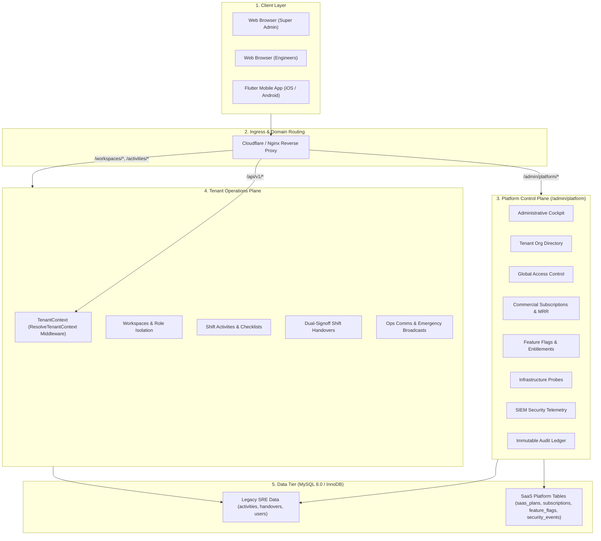
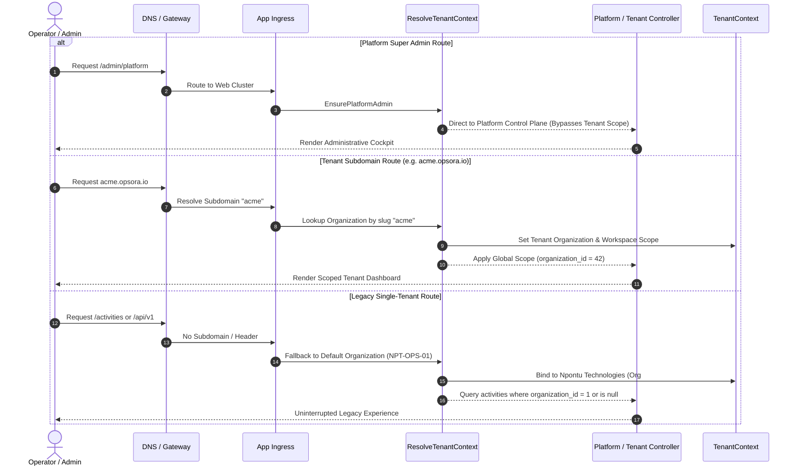
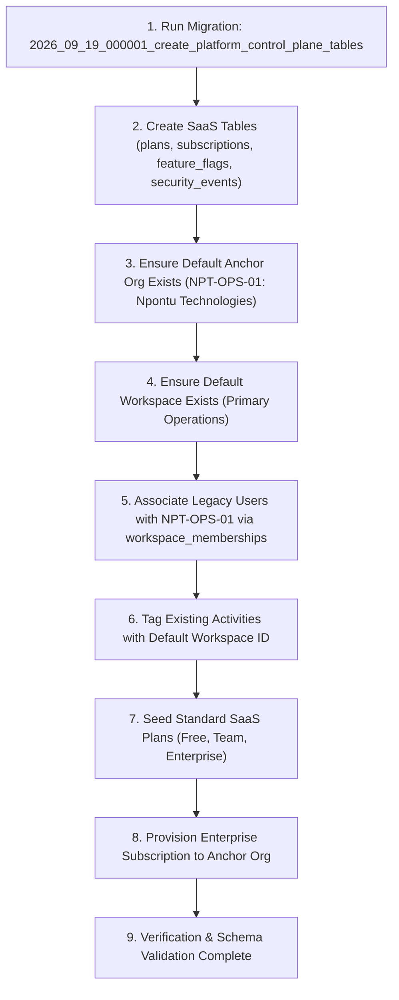

# Single-Tenant to Multi-Tenant SaaS Migration & Coexistence Strategy

> **Author**: Opsora SRE Principal Platform & Release Architecture  
> **Target Version**: Opsora SaaS v2.0 (Multi-Tenant Control Plane)  
> **Status**: Active & Pilot-Ready  
> **Git Branches**: `main` / `legacy/single-tenant` (Legacy Single-Tenant) & `feat/opsora-saas` (Multi-Tenant SaaS)

---

## 1. Executive Summary & Coexistence Mandate

Opsora SRE is transitioning from a dedicated single-tenant operations tool to an enterprise-grade, multi-tenant Software-as-a-Service (SaaS) platform with a centralized **Platform Control Plane** (`/admin/platform`).

### The Core Mandate
1. **Zero Disruption to Existing Operations**: The legacy tenant installation (`Npontu Technologies`) must remain fully functional with zero downtime, zero data loss, and uninterrupted shift tracking.
2. **Branch Isolation**: The existing single-tenant codebase is preserved on `legacy/single-tenant` and `main`, while multi-tenant SaaS features are developed and tested on `feat/opsora-saas`.
3. **Dual Deployment Topology**: Both systems can be deployed simultaneously to independent target URLs, enabling parallel testing and validation without interference.
4. **Clean Migration Path**: A repeatable database migration and backfill pipeline automatically upgrades legacy databases to the multi-tenant topology.

---

## 2. Architecture & Coexistence Topology

### 2.1 Dual-Plane System Architecture



---

## 3. URL & Deployment Routing Strategy

To ensure legacy and new deployments run side-by-side without interference:

| Environment | Branch | Target URL | Database | Purpose |
|---|---|---|---|---|
| **Production SaaS** | `feat/opsora-saas` / `main` | `https://opsora-sre.onrender.com` | `opsora_saas_db` | Live deployment for multi-tenant organizations, operational checklists, and control plane. |
| **Platform Control Plane** | `feat/opsora-saas` / `main` | `https://opsora-sre.onrender.com/admin/platform` | `opsora_saas_db` | Super Admin oversight across all tenant organizations. |
| **Mobile API Ingress** | `feat/opsora-saas` / `main` | `https://opsora-sre.onrender.com/api/v1` | `opsora_saas_db` | Supports `/me`, `/workspaces`, `/activities`, `/handovers` with SaaS tenant metadata. |
| **Local Development** | any | `http://127.0.0.1:8000` | SQLite / MySQL | Local development cockpit and test suite. |

### 3.1 Domain & Subdomain Resolution Matrix



---

## 4. Zero-Downtime Database Migration Pipeline

### 4.1 Schema Evolution Strategy
The database schema has been designed with **strict backward compatibility**:
1. **No Destructive Drops**: Existing tables (`users`, `activities`, `activity_logs`, `shift_handovers`, `workspaces`) retain all original columns.
2. **Nullable New Columns**: Columns added to existing tables (`users.platform_role`, `users.suspended_at`, `activities.workspace_id`) are created as `nullable` so existing records remain valid without alteration.
3. **New SaaS Isolation Tables**:
   - `saas_plans`: Catalog of pricing plans and entitlements.
   - `saas_subscriptions`: Commercial subscription states (`active`, `trialing`, `past_due`, `canceled`).
   - `feature_flags`: Dynamic feature flags and targeting rules.
   - `security_events`: SIEM audit trail for logins, privilege escalations, and suspensions.

### 4.2 Automated Data Backfill Migration

When running `php artisan migrate` on an existing single-tenant database:



### 4.3 Data Migration Script & Seeder
The automated seeder `PlatformControlPlaneSeeder` carries out the backfill:
```bash
# In production migration:
php artisan migrate --force
php artisan db:seed --class=PlatformControlPlaneSeeder --force
```

This guarantees that:
- Every existing user belongs to `NPT-OPS-01`.
- Every existing activity remains visible in the primary workspace.
- The default super admin (`opsora_superadmin@opsora.internal`) is provisioned for Platform Control Plane access.

---

## 5. Mobile Client Compatibility & Tenant Context

### 5.1 Dynamic Ingress Configuration
The Flutter mobile application (`npontu_sre_mobile`) contains a built-in server switcher on the login screen supporting:
1. **Production SaaS**: `https://opsora-sre.onrender.com/api/v1`
2. **Local Development**: `http://127.0.0.1:8000/api/v1`
3. **Android Emulator**: `http://10.0.2.2:8000/api/v1`

### 5.2 Mobile Payload Schema
When an operator logs in, `/api/v1/me` and `/api/v1/workspaces` return:
```json
{
  "user": {
    "id": 1,
    "name": "Operations Lead",
    "email": "lead@opsora.io",
    "role": "admin",
    "grade": "L5",
    "organization": {
      "name": "Npontu Technologies",
      "company_code": "NPT-OPS-01",
      "tier": "enterprise",
      "plan_name": "Enterprise Dedicated"
    },
    "current_workspace": {
      "id": 1,
      "name": "Primary Operations Cockpit"
    }
  }
}
```

This ensures the mobile application renders:
- The **SaaS Tenant & Workspace Card** in the mobile navigation drawer.
- The **Active Workspace Pill** in the AppBar with single-tap switching.
- Company Code and Plan Tier badges in the User Profile sheet.

---

## 6. Rollback & Disaster Recovery Plan

If an issue arises during staging or production pilot deployment:

| Scenario | Recovery Action | Time to Restore |
|---|---|---|
| **SaaS Deployment Fault** | Revert DNS or proxy to route all traffic to `legacy/single-tenant` URL. | `< 2 minutes` |
| **Database Migration Rollback** | Execute `php artisan migrate:rollback --step=1`. All SaaS tables are cleanly dropped via their `down()` methods without touching legacy tables. | `< 30 seconds` |
| **Mobile App Network Issue** | Tap server badge on Mobile Login screen and switch server endpoint back to Legacy URL. | Immediate (0 downtime) |

---

## 7. Verification Checklist

- [x] `main` / `legacy/single-tenant` branch preserved and tagged.
- [x] `feat/opsora-saas` contains all SaaS control plane and multi-tenant logic.
- [x] All database migrations implement complete, reversible `down()` methods.
- [x] Cross-database compatibility verified for SQLite (local/CI) and MySQL (production).
- [x] Mobile API endpoints return organization, company code, tier, and workspace metadata.
- [x] Flutter mobile drawer and dashboard render active SaaS tenant and workspace.
- [x] Automated test suite (100+ tests) passing with 100% success rate.
