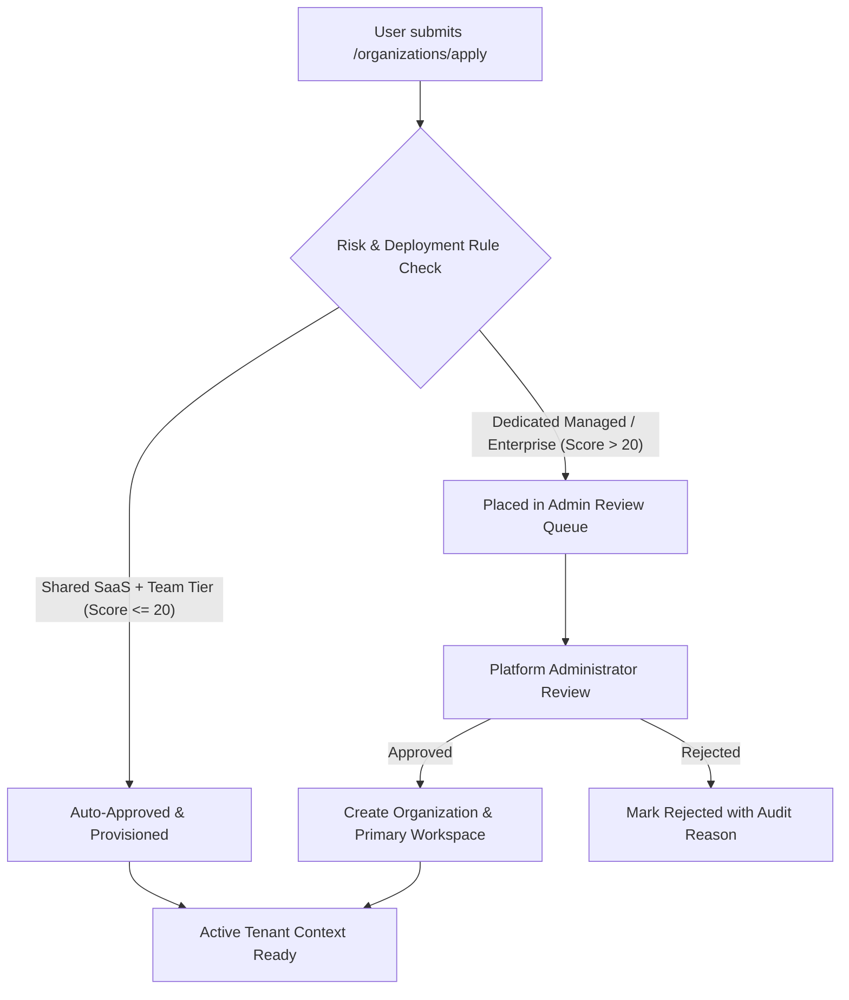

# Opsora SaaS — Tenant Onboarding & Activation Runbook

## Overview
This runbook explains the tenant onboarding lifecycles supported by Opsora:
1. **Self-Service Personal Workspace**: Instant provisioning for individual developers.
2. **Company-Code / QR Code Joining**: Instant membership attachment for employees.
3. **Self-Service Organization Registration**: Automated approval or review queue.
4. **Dedicated Enterprise Deployment Provisioning**: Managed VPC or On-Prem rollout.

---

## 1. Fast Company-Code Onboarding Flow

### Engineer User Journey
1. The company administrator distributes the unique company code (e.g., `OPS-ACME44`).
2. The user signs in to Opsora Web or opens the Opsora Mobile App.
3. On the **Workspaces Hub** (`/workspaces`), the user enters the code into the **Join by Company Code** field.
4. The system:
   - Validates that the organization is active.
   - Creates an `organization_memberships` record (`role: member`).
   - Identifies the organization's primary workspace.
   - Creates a `workspace_memberships` record (`role: agent`).
   - Switches the user's active session to the new workspace.
   - Writes an immutable audit trail entry (`event: user_joined`).

---

## 2. Self-Service Organization Application Lifecycle



---

## 3. Provisioning Workspaces via Web or API

### Via Web Hub:
1. Visit `http://localhost:8000/workspaces`.
2. Fill out **Provision New Workspace** card:
   - Workspace Name (e.g. `Payment Gateway Operations`)
   - Subdomain (e.g. `payments-ops`)
   - Retention Period (days)
3. Click **Provision Workspace &rarr;**.
4. The workspace is created, the user is assigned as admin, and the active session context is automatically switched.

### Via REST API:
```bash
curl -X POST https://opsora-sre.onrender.com/api/v1/workspaces \
  -H "Authorization: Bearer <API_TOKEN>" \
  -H "Content-Type: application/json" \
  -d '{
    "name": "Datacenter Operations Alpha",
    "subdomain": "dc-alpha",
    "retention_days": 180
  }'
```
Response: HTTP `201 Created` with full workspace object and active token.
